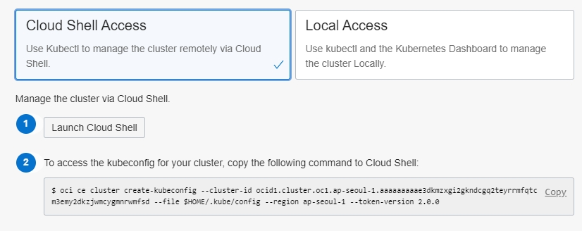

이것은 헤더
===============

이것은 서브 헤더
---------------

본문...

# 참고 URL
[마크다운? - 1](http://gjchoi.github.io/env/Kramdown(%EB%A7%88%ED%81%AC%EB%8B%A4%EC%9A%B4)-%EC%82%AC%EC%9A%A9%EB%B2%95/)

[마크다운? - 2](https://theorydb.github.io/envops/2019/05/22/envops-blog-how-to-use-md/#%EC%9D%B4%EB%AF%B8%EC%A7%80%EB%A5%BC-%EC%89%BD%EA%B2%8C-%EC%97%85%EB%A1%9C%EB%93%9C-%ED%95%98%EB%8A%94-%EB%B0%A9%EB%B2%95)

[markdown editor](https://jbt.github.io/markdown-editor/)

# 언어설정

설명에 나오는 모든 명칭은 한글로 되어 있습니다.  
OCI 대시보드가 영문으로 보이는 분은 우측 상단의 지구본 아이콘을 눌러 한글로 변경하시면 됩니다.

1

2

3

4

