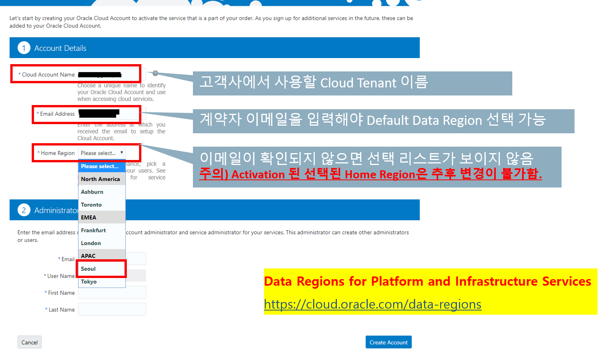
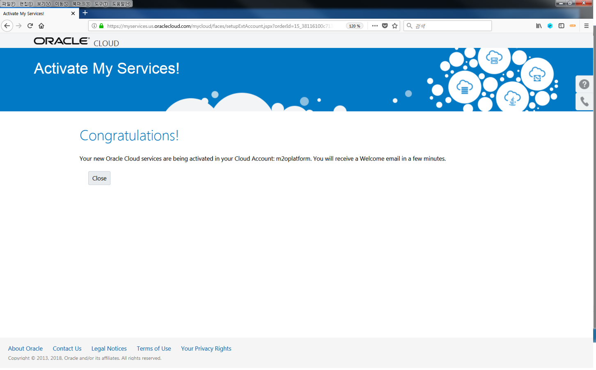

# 1. Activation Mail 수신 from oracle

OCI Tenancy 환경을 Activation(Provioning)을 위해서는
고객이 받은 Activation Mail의 다음 절차에 따라 Action을 수행해야 합니다.

<!--    -->

# 2. Account 와 Administrator 정보 인력

<!--    -->

# 3. Activation 완료

<!--    -->
